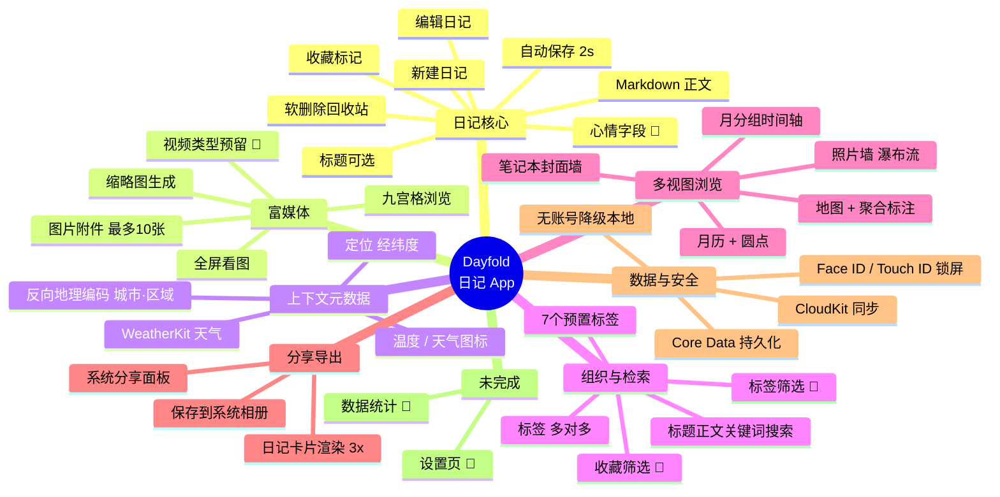
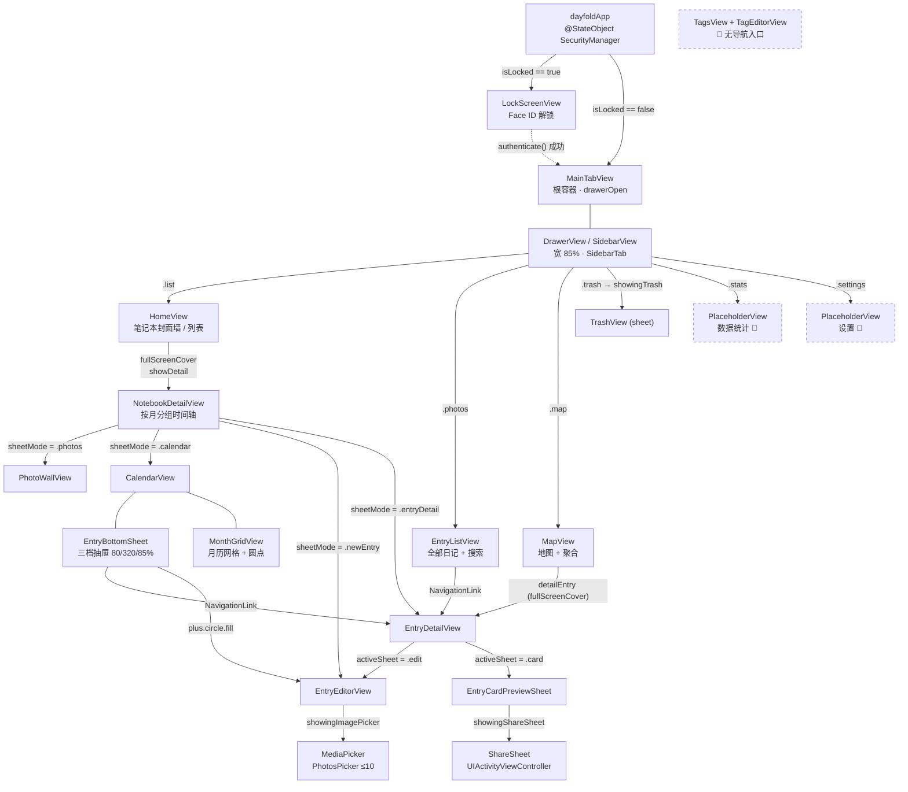
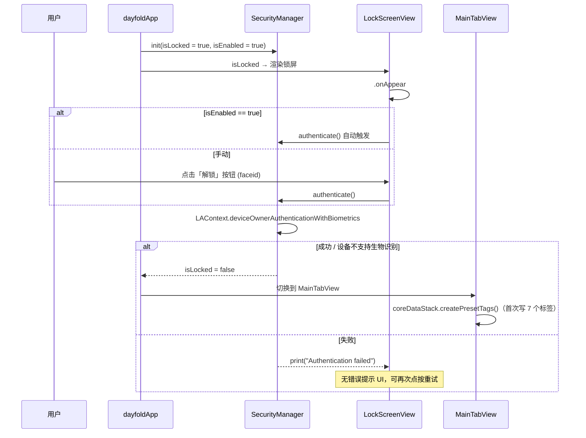
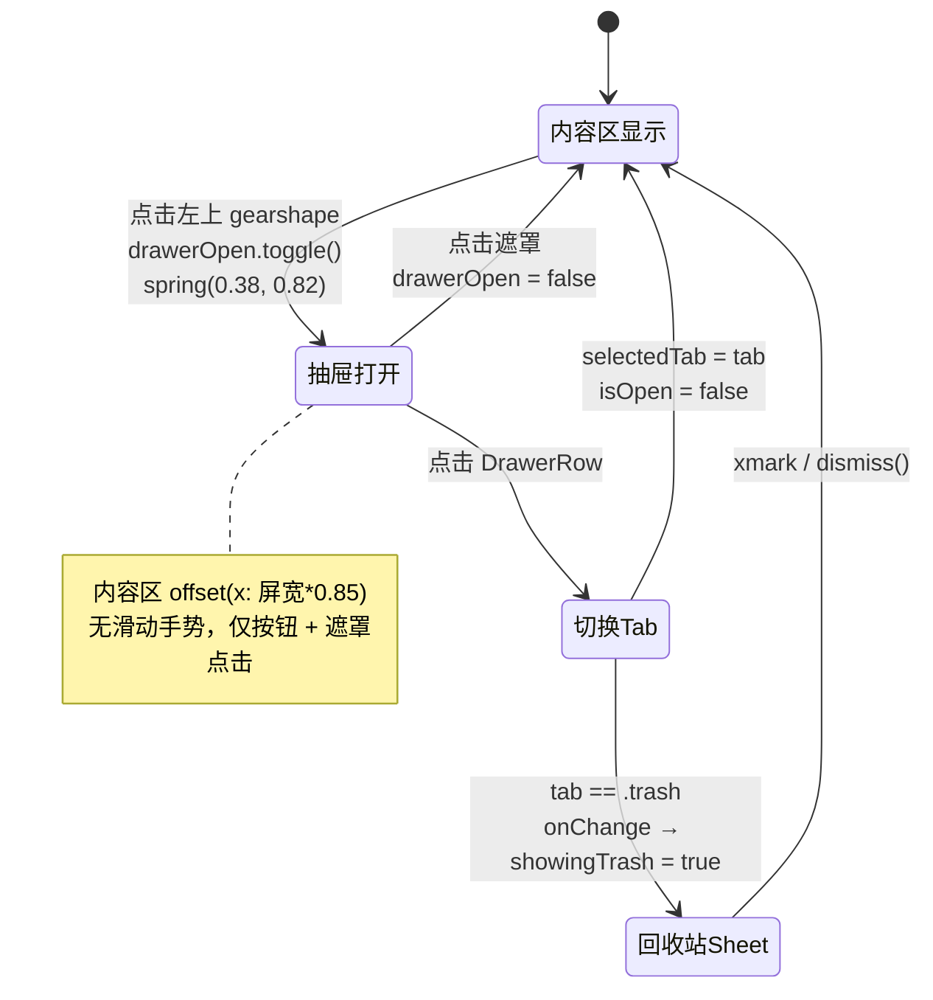
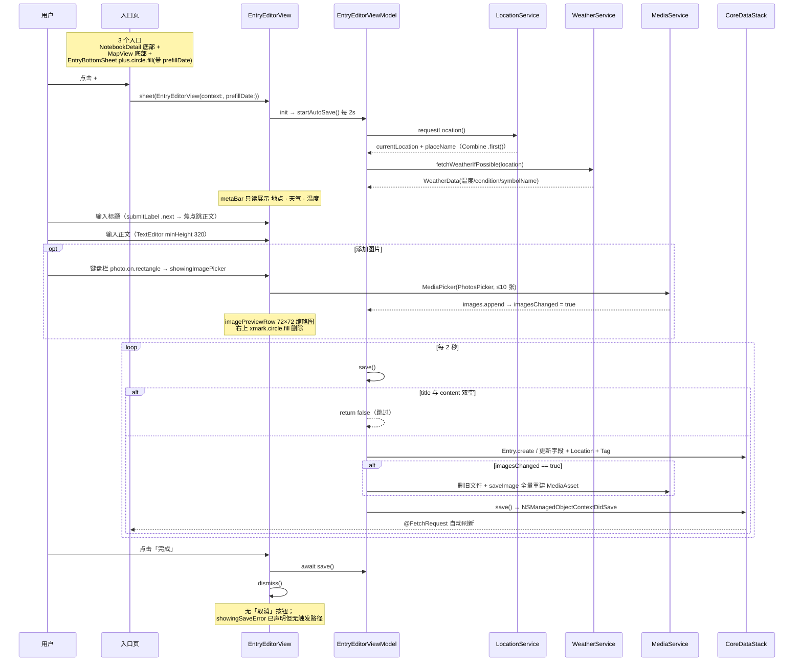
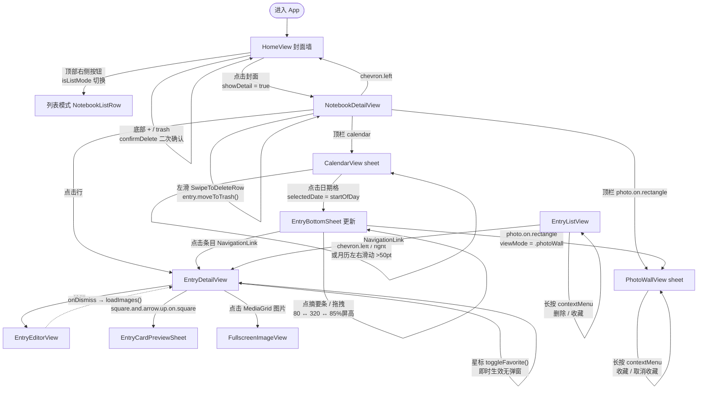
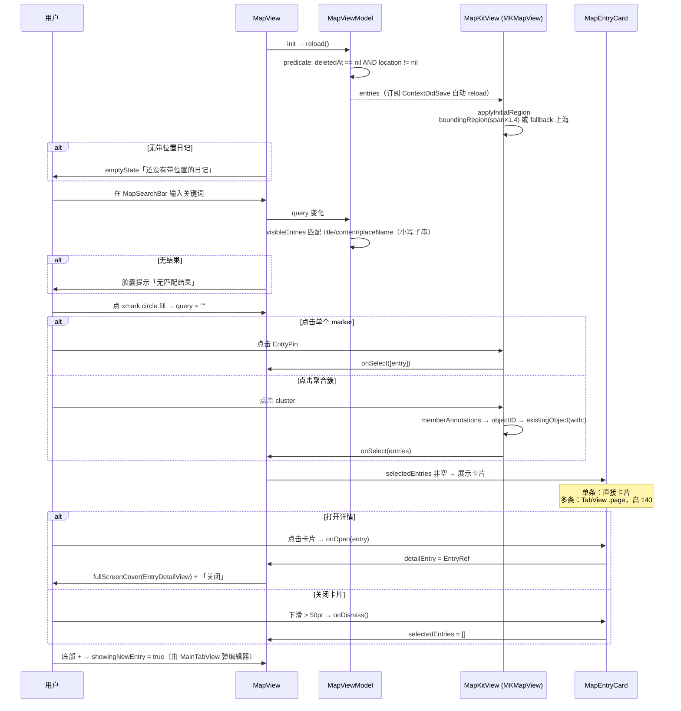
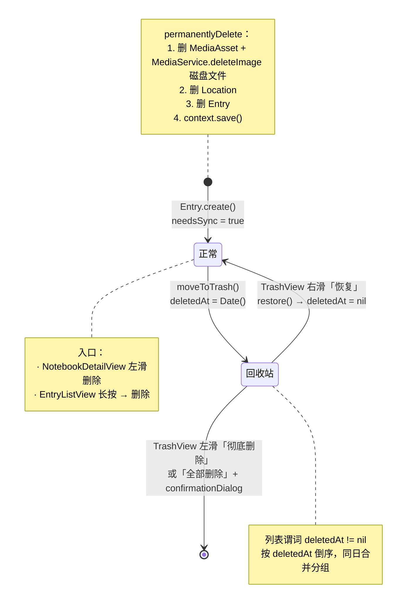
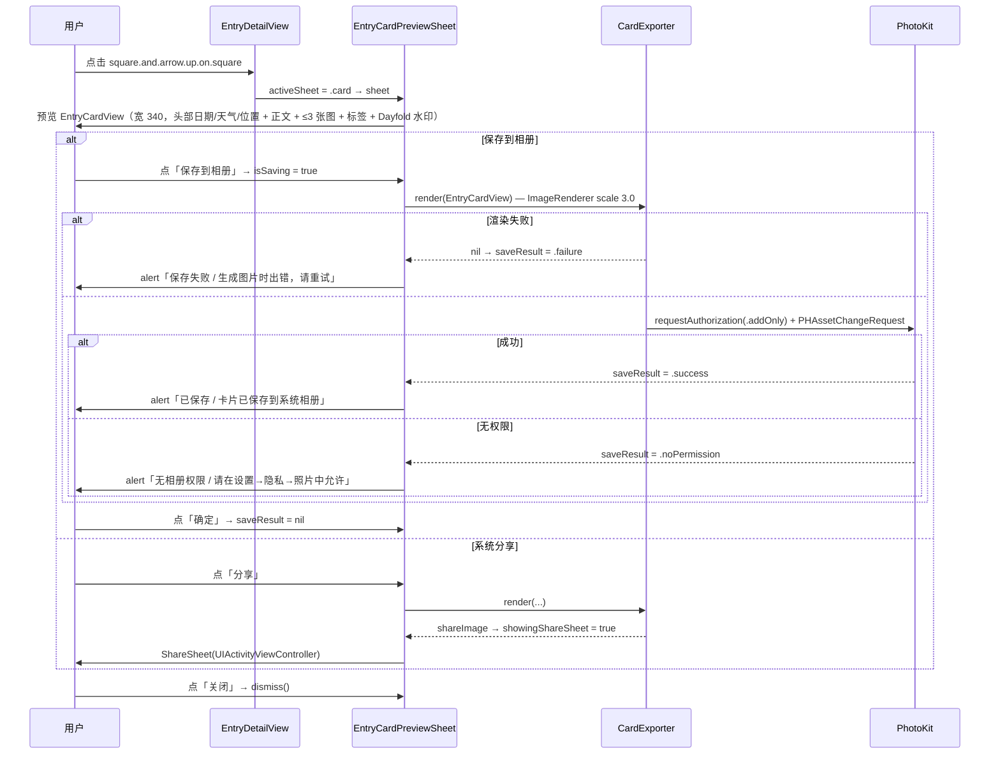
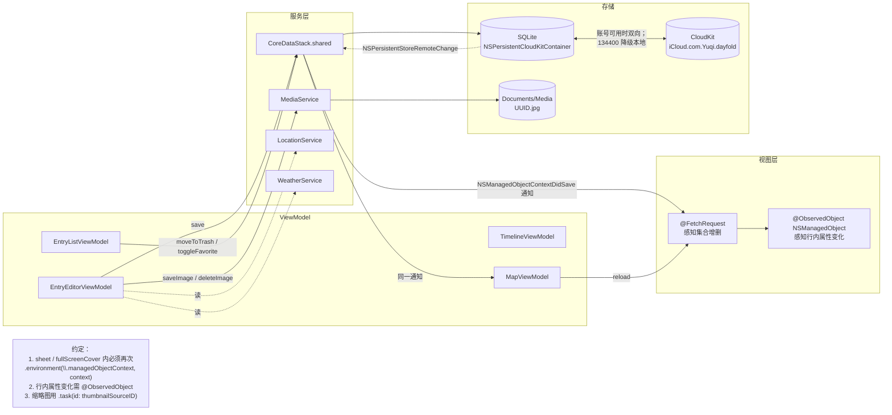

# Dayfold 项目梳理（功能 / 页面 / UI 交互流程）

> 生成日期：2026-07-27
> 依据：`dayfold/dayfold/` 源码实际实现（非设计文档），所有结论可回溯到文件与符号。
> 图例：实线箭头 = 页面跳转；虚线箭头 = 数据流；🚧 = 代码中存在但未接入 UI / 占位未实现。

---

## 一、功能清单

### 1.1 功能全景图

### 1.2 功能 → 代码依据

| 功能 | 关键实现 |
| --- | --- |
| 日记 CRUD | `Models/Entry.swift`（`create` / `moveToTrash` / `restore`）、`EntryEditorViewModel.save()` |
| 自动保存 | `EntryEditorViewModel.startAutoSave()`，`Timer` 间隔 2.0s |
| 图片附件 | `Services/MediaService.swift`（`saveImage` / `loadImage` / `generateThumbnail`），落盘 `Documents/Media/{UUID}.jpg`，DB 仅存 `filename` |
| 定位 | `Services/LocationService.swift`，`kCLLocationAccuracyHundredMeters` + `reverseGeocode` |
| 天气 | `Services/WeatherService.swift`，WeatherKit `currentWeather` |
| 标签 | `Models/Tag.swift`（`presetTags()` 7 个）、`TagManagerViewModel` |
| 收藏 | `Entry.isFavorite`，入口：详情页星标、列表长按菜单、照片墙长按菜单 |
| 回收站 | `Entry.deletedAt` 软删除；`TrashView` 恢复 / 彻底删除 / 全部删除 |
| 卡片导出 | `Services/CardExporter.swift`，`ImageRenderer(scale: 3.0)` + `PHAssetChangeRequest` |
| CloudKit | `Services/CoreDataStack.swift`，容器 `iCloud.com.Yuqi.dayfold`，错误 134400 降级本地 |
| 生物识别锁 | `Services/SecurityManager.swift`，`LAContext.deviceOwnerAuthenticationWithBiometrics` |

### 1.3 已知未完成项（重要）

| 项 | 现状 |
| --- | --- |
| **笔记本（Notebook）** | 只是 `HomeView.swift` 内的 Swift `struct` + `@State` 数组，**没有 Core Data 实体**；`NotebookDetailView` 的 `@FetchRequest` 不带 notebook 谓词，展示的是**全部日记**。App 重启后笔记本列表丢失。 |
| **FormattingToolbar / MarkdownEditor** | 组件已写好（加粗、斜体、列表、有序列表、引用、链接、待办 7 个按钮），**未接入** `EntryEditorView`。编辑器实际键盘栏只有 4 个键，其中 `paperclip`、`textformat` 是空闭包。 |
| **TagPicker** | 组件与 `EntryEditorViewModel.addTag/removeTag` 均存在，**编辑器未挂载**，无法在写日记时选标签。 |
| **标签新建** | `TagManagerViewModel.createTag` 已实现，`TagsView` **无 "+" 入口**，只能编辑已有标签。 |
| **列表筛选** | `EntryListViewModel.showFavoritesOnly` / `selectedTags` 已实现，`EntryListView` **无 UI 开关**。 |
| **心情** | `Entry.mood` 字段 + `wrappedMood` 存在，编辑器无输入入口。 |
| **视频** | `MediaAsset.MediaType.video` 已枚举，`MediaService` 只处理图片。 |
| **数据统计 / 设置** | 侧边栏可点，落到 `PlaceholderView`（"即将推出"）。 |
| **PhotoWallView 点击** | `TimelineView` 未传 `onSelectEntry`，点击无响应；contextMenu "编辑条目" 是空实现。 |

---

## 二、页面清单与导航结构

### 2.1 页面地图

### 2.2 页面职责表

| 页面 | 文件 | 呈现方式 | 职责 |
| --- | --- | --- | --- |
| LockScreenView | `Views/LockScreenView.swift` | 根级替换 | 生物识别解锁 |
| MainTabView | `Views/MainTabView.swift` | 根容器 | 抽屉 + 内容区，`selectedTab` 驱动 |
| DrawerView | `Views/SidebarView.swift` | 左侧 85% | 6 个 `SidebarTab` 导航项 |
| HomeView | `Views/HomeView.swift` | 内容区 | 笔记本封面墙（TabView 翻页）/ 列表模式 |
| NotebookDetailView | `Views/NotebookDetailView.swift` | fullScreenCover | Day One 风格月分组时间轴 |
| EntryListView | `Views/Entry/EntryListView.swift` | 内容区 | 全部日记卡片列表 + `.searchable` |
| MapView | `Views/Map/MapView.swift` | 内容区 | MKMapView + 聚合 + 搜索 + 底部卡片 |
| TrashView | `Views/Entry/TrashView.swift` | sheet | 回收站，按 `deletedAt` 同日分组 |
| EntryDetailView | `Views/Entry/EntryDetailView.swift` | push / sheet | 日记详情 + 收藏 / 卡片 / 编辑 |
| EntryEditorView | `Views/Entry/EntryEditorView.swift` | sheet | 新建 / 编辑，自动保存 |
| EntryCardPreviewSheet | `Views/Entry/EntryCardPreviewSheet.swift` | sheet | 卡片预览 → 存相册 / 分享 |
| CalendarView | `Views/Timeline/CalendarView.swift` | sheet | 月历 + 底部抽屉 |
| MonthGridView | `Views/Timeline/MonthGridView.swift` | 子视图 | 7 列日期网格，圆点最多 3 个 + `N+` |
| EntryBottomSheet | `Views/Timeline/EntryBottomSheet.swift` | 叠加层 | 三档高度当日条目抽屉 |
| PhotoWallView | `Views/Timeline/PhotoWallView.swift` | sheet | 3 列瀑布流，收藏项占 2 列大格 |
| TimelineView | `Views/Timeline/TimelineView.swift` | 🚧 无入口 | 列表 / 日历 / 照片墙分段切换容器 |
| TagsView | `Views/Tags/TagsView.swift` | 🚧 无入口 | 标签列表，重排 / 删除 / 编辑 |

---

## 三、UI 交互流程

### 3.1 启动与解锁

### 3.2 抽屉导航

### 3.3 写日记主流程（新建）

### 3.4 浏览与查看日记

### 3.5 地图页交互

### 3.6 删除与恢复（软删除生命周期）

### 3.7 卡片导出与分享

### 3.8 数据流与刷新机制

---

## 四、关键交互约定（避免踩坑）

| 约定 | 原因 |
| --- | --- |
| `sheet` / `fullScreenCover` 内必须再次注入 `managedObjectContext` | 否则子视图拿到系统默认空 context，写入不被 `@FetchRequest` 感知 |
| 行内属性变化的视图声明 `@ObservedObject var entry: Entry` | `@FetchRequest` 只感知集合增删。已改造：`EntryCard`、`EntryHeader`、`TagRow`、`EntryDetailView` |
| 用 `.sheet(item:)` 而非 `.sheet(isPresented:)` + 独立 `@State` 日期 | 避免 SwiftUI 同帧捕获旧值导致 `prefillDate` 失效 |
| `save()` 空内容判定必须 `title.isEmpty && content.isEmpty` 双空 | 只判 content 会静默丢弃"只填标题"的日记 |
| `MapKitView` 用 `NSManagedObjectID` 而非直接持有 `NSManagedObject` | 避免跨线程持有托管对象 |
| `MediaService.isValidFilename` 拒绝 `..` `/` `\` `:` | 防路径穿越 |

---

## 五、建议的下一步（按影响面排序）

1. **笔记本落地为 Core Data 实体** —— 当前是纯 `@State`，重启丢失，且 `NotebookDetailView` 展示的是全部日记而非本笔记本的日记。这是最大的功能性缺口。
2. **接入 `FormattingToolbar` + `TagPicker` 到 `EntryEditorView`** —— 组件已完成，只需挂载，即可解锁 Markdown 编辑与写作时打标签。
3. **给 `TagsView` 加导航入口和 "+" 新建按钮** —— `createTag` 已实现，页面目前从任何路径都到不了。
4. **`EntryListView` 暴露收藏 / 标签筛选 UI** —— ViewModel 已支持。
5. **补 `EntryEditorView` 的取消按钮与保存失败提示** —— `showingSaveError` 已声明但无触发路径，错误被 `try?` 吞掉。
